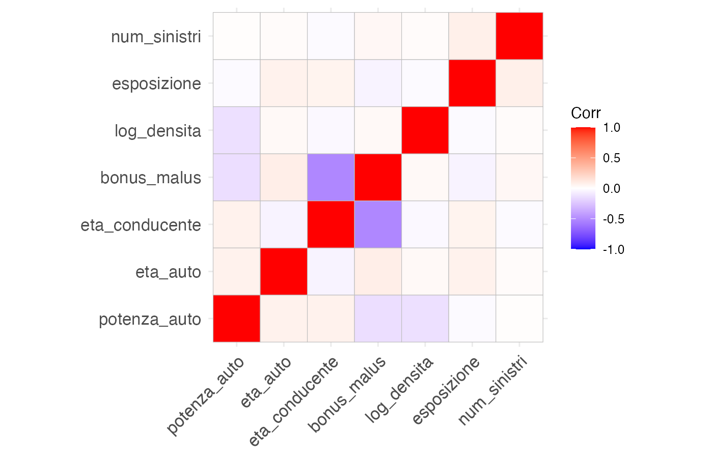
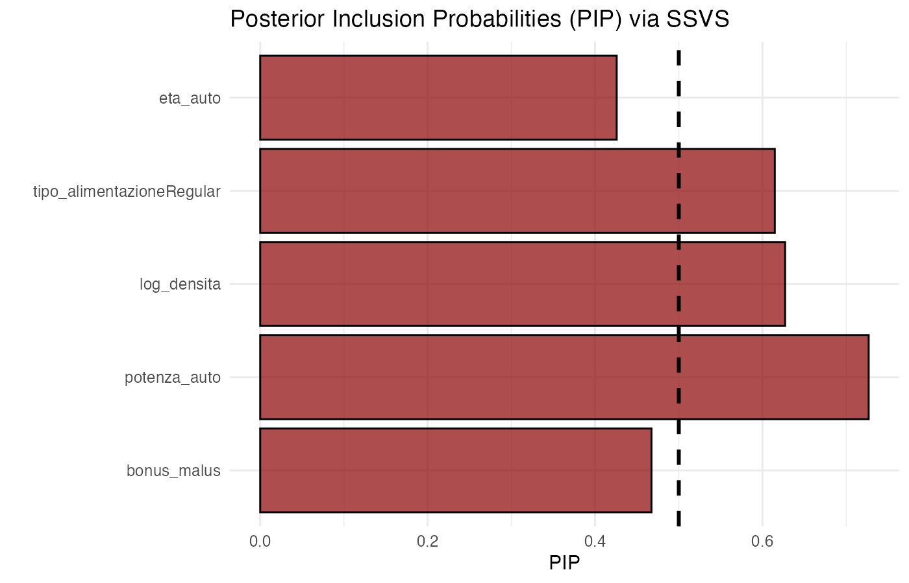
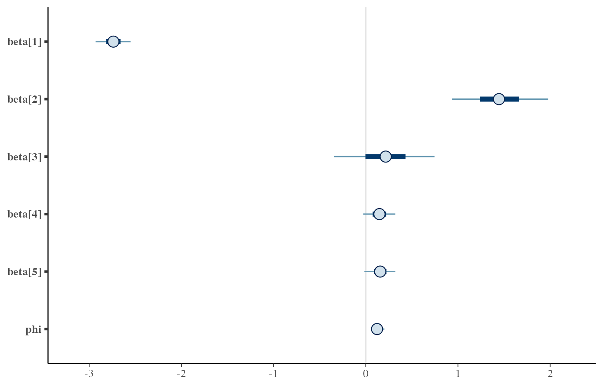

# Bayesian Count Models for Motor Insurance Claims

**A Bayesian analysis of claim frequency in the Corsica region (freMTPL2freq dataset)**

Inference performed in R and Stan · MSc in Statistical and Economic Sciences, University of Milano-Bicocca

---

## Overview

This project models the frequency of motor third-party liability claims using a fully Bayesian approach. Starting from a baseline Poisson GLM, the analysis progressively addresses three modelling challenges: the non-linear effect of driver age, overdispersion in the count distribution, and uncertainty about which covariates genuinely matter.

The final specification is a **Negative Binomial regression** with categorised driver age, retaining only the covariates supported by a stochastic search variable selection procedure.

---

## Data

The analysis uses `freMTPL2freq` from the `CASdatasets` package, restricted to policies in the **Corsica** region.

| | |
|---|---|
| Observations | 4,516 policies |
| Response | Number of reported claims |
| Offset | Exposure in policy-years |
| Zero claims | 97.6% of policies |
| Variance/mean ratio | 1.35 |

**Claim distribution**

| Claims | 0 | 1 | 2 | 3 |
|---|---|---|---|---|
| Frequency | 4407 | 88 | 19 | 2 |

The variance-to-mean ratio above 1 is a first indication of overdispersion relative to the Poisson, where mean and variance coincide by construction.

### Covariates

| Variable | Description | Role |
|---|---|---|
| `num_sinistri` | Number of reported claims | Response |
| `esposizione` | Policy-years at risk | Offset |
| `eta_conducente` | Driver age | Categorised (Young / Adult / Senior) |
| `eta_auto` | Vehicle age | SSVS candidate |
| `tipo_alimentazione` | Fuel type (Diesel / Regular) | SSVS candidate |
| `potenza_auto` | Vehicle power (standardised) | SSVS candidate |
| `bonus_malus` | Bonus-malus coefficient (standardised) | SSVS candidate |
| `tipo_zona` | Residence area (A–D) | Random effect (GLMM) |
| `log_densita` | Log population density (standardised) | SSVS candidate |

<!-- FIGURE 1: correlogram -->


Linear correlations among covariates show no severe multicollinearity, with one notable exception: a moderate negative association between driver age and bonus-malus (r ≈ −0.5). This relationship becomes relevant later, when interpreting the variable selection results.

---

## Modelling strategy

Each model answers a specific question raised by the previous one.

| Step | Model | Question addressed |
|---|---|---|
| 1 | Poisson GLM (baseline) | Continuous predictors — adequate baseline? |
| 2 | Poisson GLM (categorised age) | Does discretising driver age improve fit? |
| 3 | Poisson GLM (variant) | Should vehicle age also be categorised? |
| 4 | Negative Binomial | Does the Poisson handle the observed overdispersion? |
| 5 | NB with random effects | Does geographic area carry its own heterogeneity? |
| 6 | NB with spike-and-slab | Which covariates are genuinely relevant? |
| 7 | Final NB (reduced) | Refit of the selected specification |

### Priors

Continuous predictors are standardised, and coefficients receive weakly informative priors:

- **β** ~ N(0, I) — weakly informative on the log-rate scale
- **φ** ~ Exponential(1) — Negative Binomial dispersion
- **σ** ~ Half-Normal(0, 1) — random effect standard deviation (GLMM)

Vague priors such as N(0, 10³) were deliberately avoided: while apparently non-informative, they inflate Bayes factors towards more complex models (Lindley's paradox) and worsen the geometry of the posterior for HMC sampling.

### Overdispersion diagnostics

Posterior predictive checks on the Poisson model revealed that the fitted distribution systematically underestimates the tail of the count distribution, while reproducing the proportion of zeros correctly. This pattern points to genuine overdispersion rather than zero inflation — which is why the Negative Binomial was preferred over zero-inflated or hurdle specifications.

### Variable selection

Covariate relevance was assessed via **Stochastic Search Variable Selection** (SSVS). Each candidate coefficient is assigned a mixture prior:

```
β_j | γ_j ~ (1 − γ_j) · N(0, τ²) + γ_j · N(0, c²τ²)
γ_j ~ Bernoulli(θ),  θ = 0.5
```

A coefficient sampled close to zero is likely generated by the narrow *spike* component (variable excluded); one far from zero by the wide *slab* (variable included). The threshold κ separating the two components is defined analytically as the point where the two densities intersect, and the Posterior Inclusion Probability (PIP) counts the proportion of iterations in which |β_j| exceeds it.

<!-- FIGURE 2: PIP barplot from SSVS -->


---

## Results

### Model comparison

| Model | WAIC | LPML | LOO-IC | Log marginal |
|---|---|---|---|---|
| Poisson (baseline) | 1163 | −590 | 1180 | −579 |
| Poisson (categorised age) | 1131 | −577 | 1155 | −566 |
| Poisson (variant) | 1139 | −580 | 1160 | −568 |
| Negative Binomial | 1085 | −551 | 1102 | −557 |
| NB + random effects | 1082 | −552 | 1103 | −554 |
| **Final NB (reduced)** | **1086** | **−549** | **1099** | **−555** |

*Lower is better for WAIC and LOO-IC; higher is better for LPML.*

Three findings emerge:

**Distributional family dominates covariate choice.** Moving from Poisson to Negative Binomial improves LOO-IC by roughly 60 points, whereas any change in the predictor set shifts it by 2–5 points. Modelling overdispersion mattered far more than selecting variables.

**Territorial heterogeneity is negligible.** The mixed model with area-level random effects performs identically to the non-hierarchical Negative Binomial, and the estimated between-area standard deviation is close to zero. Geographic area adds nothing once individual predictors are accounted for.

**Parsimony and predictive accuracy align.** The final reduced model achieves the best LPML and LOO-IC while using the fewest parameters among the Negative Binomial specifications.

### Final model

```
log(μ_i) = log(exposure_i) + β₀ + β₁·Young + β₂·Senior + β₃·log_density + β₄·power
y_i ~ NegBinomial(μ_i, φ)
```

| Parameter | Mean | SD | 95% CI | Interpretation |
|---|---|---|---|---|
| Intercept | −2.74 | 0.12 | [−2.97, −2.52] | Baseline rate (Adult drivers) |
| Young | 1.45 | 0.32 | [0.84, 2.08] | ≈ 4.3× the adult claim rate |
| Senior | 0.21 | 0.33 | [−0.46, 0.85] | No detectable effect |
| Log density | 0.15 | 0.11 | [−0.06, 0.36] | Weak, credible interval spans zero |
| Vehicle power | 0.16 | 0.10 | [−0.05, 0.35] | Weak, credible interval spans zero |
| φ (dispersion) | 0.13 | 0.04 | [0.07, 0.22] | Strong overdispersion confirmed |

<!-- FIGURE 3: credible intervals for final model parameters -->


**Driver age is the dominant risk factor.** Young drivers show a claim rate roughly 4.3 times higher than adults, with a credible interval entirely above zero. Senior drivers are statistically indistinguishable from adults. Population density and vehicle power point in the expected direction but their credible intervals include zero, indicating weak evidence on this sample.

**Bonus-malus was excluded** by the selection procedure. Although counterintuitive from an actuarial standpoint, this is explained by its negative correlation with driver age (r ≈ −0.5): once age is in the model, bonus-malus carries largely redundant information.

### Convergence diagnostics

All parameters in the final model reach R̂ = 1.00 with effective sample sizes between 7,500 and 9,700 out of 8,000 draws. Geweke z-scores fall within the |z| < 1.96 threshold for the vast majority of parameters across all chains, and Monte Carlo standard errors (naive and time-series) are practically identical, indicating negligible autocorrelation. Traceplots show well-mixed, stationary chains.

### Posterior predictive check

| Claims | 0 | 1 | 2 | 3 |
|---|---|---|---|---|
| Observed | 4407 | 88 | 19 | 2 |
| Simulated (NB) | 4406.2 | 88.4 | 14.5 | 3.9 |

The model reproduces the proportion of zeros almost exactly and captures the observed dispersion. The single-claim count is well centred, with a mild misalignment in the extreme tail — expected given that only 21 policies report more than one claim.

---

## Repository structure

```
.
├── R/
│   ├── 01_preprocessing.R      # Data loading, EDA, standardisation
│   ├── 02_poisson_models.R     # Baseline and categorised-age GLMs
│   ├── 03_negative_binomial.R  # NB and mixed-effects NB
│   ├── 04_ssvs_selection.R     # Spike-and-slab variable selection
│   └── 05_final_model.R        # Reduced NB, diagnostics, PPC
├── stan/
│   ├── poisson_corsica.stan
│   ├── nb_corsica.stan
│   ├── nb_mixed_corsica.stan
│   └── nb_ssvs_corsica.stan
├── output/
│   └── figures/
└── README.md
```

### Requirements

```r
install.packages(c("dplyr", "rstan", "bayesplot", "ggplot2", "loo",
                   "bridgesampling", "coda", "bayestestR", "ggcorrplot"))
# CASdatasets is available from http://dutangc.free.fr/pub/RRepos/
```

### Reproducing the analysis

Run the scripts in `R/` sequentially. Fitted models are not included in the repository due to size; they are regenerated automatically and can be cached with `saveRDS()`.

---

## Methodological notes

**Bayes factors and predictive criteria can disagree.** Under vague priors, marginal likelihoods systematically favoured more complex models, while LOO and WAIC did not. Once priors were tightened to weakly informative, the two approaches largely converged — a practical illustration of Lindley's paradox.

**Posterior inclusion probabilities depend on the threshold.** The PIP measures how often a coefficient exceeds a pre-specified threshold κ, not the evidence for an effect in an absolute sense. Selection results were therefore cross-validated against credible intervals and predictive comparison, which agreed with the SSVS conclusions.

**Limitations.** With 4,516 policies but only 109 claims (21 of which are multiple), statistical power to detect secondary effects is limited. Extending the analysis to additional French regions would allow a proper hierarchical treatment of between-region heterogeneity, which is not identifiable within a single homogeneous region.

---

## Author

**Luca Iaria** · MSc Statistical and Economic Sciences, University of Milano-Bicocca

Project developed for the Bayesian Statistical Modelling course.
